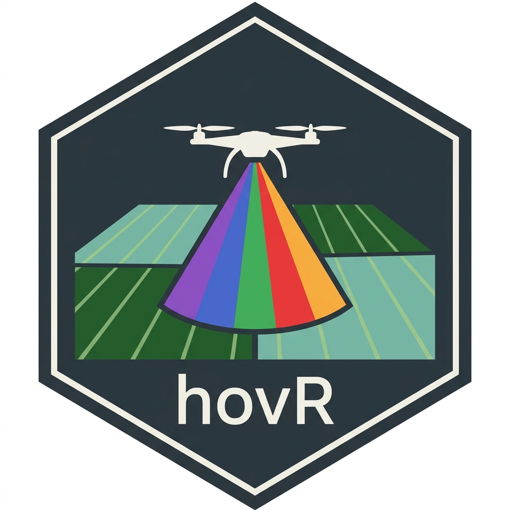

# hovR

### *End-to-end R toolkit for drone hyperspectral time-series analysis*

<p align="center">
  
</p>

---

## 🚀 What hovR does

**hovR transforms weeks of manual drone data processing into a fast, reproducible pipeline.**

| Without hovR                            | With hovR                                     |
| --------------------------------------- | --------------------------------------------- |
| Draw hundreds of plots manually in QGIS | `segment_plots()` — done in seconds           |
| Manually click calibration panels       | `detect_panels()` + `calibrate_reflectance()` |
| Trial-and-error flight selection        | `flight_qc()` with automatic report           |
| Analyze flights one by one              | `integrate_season()` across time              |
| Guess best dates for prediction         | `optimal_window()` finds them automatically   |

---

## 📦 Installation

```r
# Install from GitHub
remotes::install_github("dronehsi/hovR")
```

Dependencies are installed automatically:
`terra`, `sf`, `ggplot2`, `dplyr`, `cli`, `lubridate`

---

## 🧠 Core Modules

### 1️⃣ Flight Quality Control

Automatically evaluates blur, saturation, irradiance stability, and missing data.

```r
qc <- flight_qc(my_flight_stack)
flight_qc_report(qc, "qc_season_2024.html")
```

---

### 2️⃣ Calibration Panel Detection

No more manual clicking. Panels are detected and used for reflectance calibration.

```r
panels <- detect_panels(raw_raster, n_panels = 2,
                        panel_size_m2 = c(0.25, 0.25))

refl <- calibrate_reflectance(raw_raster, panels,
          known_reflectance = c(panel_1 = 0.50, panel_2 = 0.20))
```

---

### 3️⃣ Plot Auto-Segmentation

Automatically detects trial plots directly from imagery.

```r
plots <- segment_plots(refl, wavelengths = wl,
                        method = "combined",
                        expected_rows = 20,
                        expected_cols = 10)

plot_segmentation_qc(plots, refl)
sf::st_write(plots, "trial_plots.gpkg")
```

---

### 4️⃣ Temporal Intelligence (🚀 Core Innovation)

Treats all flights as a unified seasonal dataset.

```r
fs <- flight_stack(raster_list, dates = flight_dates,
                    wavelengths = wl)

vi  <- compute_vi(fs, indices = c("NDVI", "NDRE", "LCI"))
auc <- integrate_season(vi, index = "NDVI")
rates <- vi_derivative(vi, index = "NDRE", smooth = TRUE)

best <- optimal_window(vi, ground_truth = yield_df,
                        trait = "yield_t_ha", plots = plots)
```

---

### 5️⃣ Ground Truth Fusion

Links drone-derived metrics with field measurements.

```r
plot_data <- extract_plot(vi, plots,
                          indices = c("NDVI", "NDRE"),
                          stats   = c("mean", "sd"))

fused <- fuse_ground(plot_data,
                      ground_truth = chl_df,
                      traits = "spad_chl")
```

---

## 🔄 Complete Workflow

```
Raw drone images
      ↓
flight_qc()
      ↓
detect_panels() → calibrate_reflectance()
      ↓
segment_plots()
      ↓
flight_stack() → compute_vi()
      ↓
integrate_season() → vi_derivative() → optimal_window()
      ↓
extract_plot() → fuse_ground()
      ↓
Modeling (lm / plsr / tidymodels)
```

---

## 🌿 Built-in Vegetation Indices

| Index | Purpose                  |
| ----- | ------------------------ |
| NDVI  | General greenness        |
| NDRE  | Dense canopy chlorophyll |
| MCARI | Chlorophyll content      |
| LCI   | Leaf chlorophyll         |
| GNDVI | LAI & chlorophyll        |
| PSRI  | Senescence               |
| WBI   | Water content            |

➕ Add custom indices with `define_index()`

---

## 🔬 Why hovR matters

* 📈 **Seasonal AUC integration** → stronger trait prediction
* 🤖 **Fully automated pipeline** → eliminates manual bottlenecks
* 🧪 **Reproducible research workflows**
* ⏱️ **Saves days to weeks per project**

---

## 📄 License

MIT © 2026 hovR Authors

---

<p align="center">
  Built for precision agriculture, phenomics, and scalable field research 🌍
</p>
